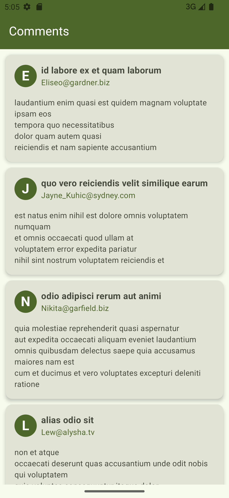

# RetrofitInAction
A simple app showcasing how [Retrofit](https://github.com/square/retrofit) can be leveraged for Network calls 

## What is Retrofit?
Retrofit is a popular type-safe HTTP client for Android and Java that makes it easier to consume RESTful web services. Developed by Square, it allows you to define your REST API as a series of interfaces and methods, abstracting away the underlying HTTP calls. This makes it easier to manage API calls and responses with minimal boilerplate code.
## Why is Retrofit Powerful for Kotlin Developers?
- **Type Safety:** Retrofit uses annotations to describe the HTTP requests, ensuring type safety at compile time.
- **Coroutines Support:** With Retrofit, you can easily integrate Kotlin coroutines to handle asynchronous operations, providing a more concise and manageable codebase.
- **Scalability:** Retrofit allows for modular and scalable code, supporting dynamic URL endpoints and query parameters.
- **Customizable:** You can customize requests and responses with interceptors, converters, and adapters.


# Let's Build 👷‍♂️⚒️🪛
## What are we building?
For this tutorial we will build a simple comments app that fetches comments data from  a free API Faker {JSON} Placeholder. Here is the endpoint: https://jsonplaceholder.typicode.com/comments. 
While getting data from the internet using **Retrofit** is the primary focus for this project, we will use other libraries including

- [x] **Koin** - for dependency injection 
- [x] **Kotlinx-serialization** - core library for serializing and deserializing Kotlin objects
- [x] **kotlinx-serialization-json** - provides JSON Format specific support . For entity serialization
- [x] **kotlinx-serialization converter** for Retrofit. 
- [x] **Kotlinx-coroutines**
- [x] **Okhttp3**
- [x] **Lifecycle**

## Step 1: Add Dependencies and Plugins
### We use versions Catalog
- Add the following in ```libs.versions.toml``` file
```toml
[versions]
# ... Rest of the code
kotlin = "2.0.0"
lifecycle= "2.8.4"
retrofit = "2.11.0"
okhttp3 = "4.12.0"
kotlinxSerialization = "2.0.0"
kotlinxSerializationJson = "1.7.1"
retrofitSerializationConverter = "2.11.0"
coroutines = "1.9.0-RC"
koin = "3.5.6"
koinCompose = "3.4.6"

```
```toml
[libraries]
# ... Rest of the code
#network
kotlinx-serialization-json = { module = "org.jetbrains.kotlinx:kotlinx-serialization-json", version.ref = "kotlinxSerializationJson"}
retrofit = { module = "com.squareup.retrofit2:retrofit", version.ref = "retrofit"}
retrofit-serialization = { module = "com.squareup.retrofit2:converter-kotlinx-serialization", version.ref = "retrofitSerializationConverter" }
okhttp3 = { module = "com.squareup.okhttp3:okhttp", version.ref = "okhttp3"}
coroutines-core = { module = "org.jetbrains.kotlinx:kotlinx-coroutines-core", version.ref = "coroutines" }
coroutines-android = { module = "org.jetbrains.kotlinx:kotlinx-coroutines-android", version.ref = "coroutines" }
#lifecycle
lifecycle-viewmodel-compose = { module = "androidx.lifecycle:lifecycle-viewmodel-compose", version.ref = "lifecycle" }
compose-lifecycle = { module = "androidx.lifecycle:lifecycle-runtime-compose", version.ref = "lifecycle"}
#koin for di
koin-core = { module ="io.insert-koin:koin-core", version.ref = "koin"}
koin-android = { module = "io.insert-koin:koin-android", version.ref = "koin"}
koin-androidx-compose = { module = "io.insert-koin:koin-androidx-compose", version.ref = "koinCompose"}
```
```toml
[Plugins]
# ... Rest of the code
compose-compiler = { id = "org.jetbrains.kotlin.plugin.compose", version.ref = "kotlin" } #Starting kotlin 2.0 is required. #Compose Compiler Gradle plugin makes setting up and configuring Compose easier.
kotlinx-serialization = {id = "org.jetbrains.kotlin.plugin.serialization", version.ref="kotlinxSerialization"}

```
> I prefer ``bundling`` dependencies, so I can just provide them as a group rather than having to provide individual dependencies in my gradle file. Below is how I have bundled the dependencies. The idea is to have related dependencies in one group.
create this below plugins in the ``libs.versions.toml`` file.

```toml
[bundles]
network = [ "kotlinx-serialization-json","retrofit", "retrofit-serialization",
    "coroutines-core", "coroutines-android", "okhttp3" ]
lifecycle = ["androidx-lifecycle-runtime-ktx", "compose-lifecycle", "lifecycle-viewmodel-compose"]
koin =[ "koin-core", "koin-android", "koin-androidx-compose" ]
```
- Now, add plugins and dependencies to the gradle files.
    - Add the following in ```build.gradle.kts``` project-level file

    ```kotlin
    plugins {
        // ... Rest of the code
        alias(libs.plugins.compose.compiler) apply false
        alias(libs.plugins.kotlinx.serialization) apply false
    }
    ```
    * Add the following in ```build.gradle.kts``` app-level file

    ```kotlin
    plugins {
        // ... Rest of the code
        alias(libs.plugins.compose.compiler)
        alias(libs.plugins.kotlinx.serialization)
    }

    dependencies {
        // ... Rest of the code
        implementation(libs.bundles.network)
        implementation(libs.bundles.lifecycle)
        implementation(libs.bundles.koin)
    }
    ```
    - Notice we only needed to provide the ``bundles`` we created earlier and as such we didn't need to provide individual dependencies. Just three lines! That's the beauty of using ``bundles`` in ``versions catalog``.

## Step 2: Define your entity class
- Now you need an entity class to hold your data. For our demo project we are getting ``comments`` data from a free API Faker ```{JSON} Placeholder```
Create a package called ``models``, inside it create a file ``Comment.kt`` with the following code.

```kotlin
@Serializable
data class Comment(
    val body: String,
    val email: String,
    val id: Int,
    val name: String,
    val postId: Int
)
```
Notice the @Serializable annotation - it helps us serialize our entity object and represnt it in other formats such as ``JSON``

## Step 3: Set up Your API Service
- Create a package called ``network``. Inside it, create a file called ``CommentsAPIService.kt``
- You need a ``retrofit client`` for your API service to help you get data from the internet. Inside your ``CommentsAPIService.kt`` file create an object of the client like this
```kotlin
private val json = Json {
    prettyPrint = true
    isLenient = true
    ignoreUnknownKeys = true
}
private val contentType = "application/json".toMediaType()


object RetrofitClient {
    private const val BASE_URL = "https://jsonplaceholder.typicode.com/"

    fun create(): Retrofit =
        Retrofit.Builder()
        .baseUrl(BASE_URL)
        .addConverterFactory(json.asConverterFactory(contentType))
        .build()
}

```
- Notice that our client uses a ``json``object from ``kotlinxserialization`` and ``contentType`` from ``okhttp3`` (helps us specifiy the MediaType). More ``configurations`` can be done but for brevity we will keep ours simple.
  Now, we need an ``APIService``. Inside ``CommentsAPIService.kt``, below the ``retrofit client`` create an API Service interface as follows
```kotlin
interface CommentsAPIService {
    @GET("comments")
    suspend fun getComments(): Response<List<Comment>>
}
```
## Step 4: Set up Your Repository
- We use the ``Repository pattern`` to keep things clean and organized. Besides, the ``repository pattern`` helps to abstract the data access layer, providing a clean separation between the application's business logic and how it interacts with data sources.
- First, we need a custom ``NetworkResult`` generic sealed class to hold the network responses.  Create the sealed ``NetworkResult`` class inside the ``network`` package

```kotlin
sealed class NetworkResult<out T> {
    data class Success<out T>(val data: T) : NetworkResult<T>()
    data class Error(val message: String) : NetworkResult<Nothing>()
}
```

- Now Create a ``repository`` package, inside the package create the ``repository interface`` and the ``implementation class`` as follows
```kotlin
interface CommentsRepository {
    suspend fun getComments(): NetworkResult<List<Comment>>
}

class CommentsRepositoryImpl(
    private val apiService: CommentsAPIService,
    private val dispatcher: CoroutineDispatcher
): CommentsRepository {

    override suspend fun getComments(): NetworkResult<List<Comment>> {
        return withContext(dispatcher){
            try{
                val response = apiService.getComments()
                if(response.isSuccessful){
                    val comments = response.body() ?: emptyList()
                    NetworkResult.Success(comments)
                }else{
                    NetworkResult.Error(response.message())
                }
            }catch (e: Exception){
                NetworkResult.Error(e.message ?: "Something went wrong")
            }
        }
    }
}
```
- We parse an ``apiService`` to help us get data and the ``coroutineDispatcher`` to help us with switching tasks to background threads.

## Step 5: Prepare ViewModel
- Create a new package ``viewmodel``
- Inside create a file named ``CommentsViewModel`` with this code
```kotlin
data class CommentsUIState(
    val comments: List<Comment> = emptyList(),
    val error: String? = null,
    val isLoading: Boolean = false
)

class CommentsViewModel(
    private val repository: CommentsRepository
): ViewModel() {

    private val _commentsUIState = MutableStateFlow(CommentsUIState())
    val commentsUIState: StateFlow<CommentsUIState> = _commentsUIState.asStateFlow()

    init {
        getComments()
    }

    private fun getComments(){

        _commentsUIState.value = _commentsUIState.value.copy(isLoading = true, comments = emptyList())

        viewModelScope.launch {
            val result = repository.getComments()
            when(result){

                is NetworkResult.Success -> {
                    _commentsUIState.update {
                        it.copy(
                            comments = result.data,
                            isLoading = false,
                        )
                    }
                }

                is NetworkResult.Error -> {
                    _commentsUIState.update {
                        it.copy(
                            isLoading = false,
                            error = result.message
                        )
                    }
                }
            }
        }
    }
}
```
Notice we used flows and UIState.

## Step 6: Set up dependency injection with koin
- Create a new package called ``di``. Inside create a new file ``AppModules`` and declare your dependencies as follows

```kotlin
val appModules = module {
    // Retrofit
    single { RetrofitClient.create() }
    // API Service
    single { get<Retrofit>().create(CommentsAPIService::class.java) }
    // Dispatcher
    single { Dispatchers.IO }
    // Repository
    single<CommentsRepository> { CommentsRepositoryImpl(get(), get()) }
    // ViewModel
    single { CommentsViewModel(get()) }

}
```
- Next, create an ``Application`` class that extends the ``Application class``. We start ``Koin`` from this class

```kotlin
import android.app.Application
import com.samueljuma.retrofitinaction.di.appModules
import org.koin.android.ext.koin.androidContext
import org.koin.core.context.startKoin

class RetrofitInActionApplication: Application() {
    override fun onCreate() {
        super.onCreate()
        startKoin{
            androidContext(this@RetrofitInActionApplication)
            modules(appModules)
        }
    }
}
```

## Step 7: Modify the ``AndroidManifest.xml`` file
- Next, in the manifest file, add the Application class inside the application tags
- ALso, explicitly declare your network permissions. Without this your app wont be able to get data from the internet.
```xml
<?xml version="1.0" encoding="utf-8"?>
<manifest xmlns:android="http://schemas.android.com/apk/res/android"
    xmlns:tools="http://schemas.android.com/tools">

    <!--You need to explittly include permisssions for internet-->
    <uses-permission android:name="android.permission.INTERNET"/>
    <uses-permission android:name="android.permission.ACCESS_NETWORK_STATE"/>

<application
    android:name=".RetrofitInActionApplication"

    <!-- Rest of the code -->
 >
 
<!-- Rest of the code -->

</application>
```

## Step 8: Prepare your UI
- Now, we need the UI from where we will be displaying our comments. Here, we display specific UI for different UIStates as shown in the code below.
- In your root package, create a new package called ``screens``, inside it create a file ``CommentsListScreen.kt `` that has the ``UI code`` as follows:-

> Notice we use viewModel from ``koinViewModel`` - since we have ``dependency injection`` set up already with ``koin``
```kotlin

import androidx.compose.animation.AnimatedVisibility
import androidx.compose.foundation.background
import androidx.compose.foundation.layout.Arrangement
import androidx.compose.foundation.layout.Box
import androidx.compose.foundation.layout.Column
import androidx.compose.foundation.layout.Row
import androidx.compose.foundation.layout.Spacer
import androidx.compose.foundation.layout.fillMaxSize
import androidx.compose.foundation.layout.fillMaxWidth
import androidx.compose.foundation.layout.padding
import androidx.compose.foundation.layout.size
import androidx.compose.foundation.layout.width
import androidx.compose.foundation.lazy.LazyColumn
import androidx.compose.foundation.lazy.items
import androidx.compose.foundation.shape.CircleShape
import androidx.compose.material.icons.Icons
import androidx.compose.material.icons.filled.Warning
import androidx.compose.material3.Card
import androidx.compose.material3.CardDefaults
import androidx.compose.material3.CircularProgressIndicator
import androidx.compose.material3.ExperimentalMaterial3Api
import androidx.compose.material3.Icon
import androidx.compose.material3.MaterialTheme
import androidx.compose.material3.Scaffold
import androidx.compose.material3.Text
import androidx.compose.material3.TopAppBar
import androidx.compose.material3.TopAppBarDefaults
import androidx.compose.runtime.Composable
import androidx.compose.runtime.getValue
import androidx.compose.ui.Alignment
import androidx.compose.ui.Modifier
import androidx.compose.ui.draw.clip
import androidx.compose.ui.graphics.Color
import androidx.compose.ui.text.font.FontWeight
import androidx.compose.ui.unit.dp
import androidx.compose.ui.unit.sp
import androidx.lifecycle.compose.collectAsStateWithLifecycle
import com.samueljuma.retrofitinaction.models.Comment
import com.samueljuma.retrofitinaction.viewmodel.CommentsViewModel
import org.koin.androidx.compose.koinViewModel

@OptIn(ExperimentalMaterial3Api::class)
@Composable
fun CommentsListScreen() {

    val viewModel: CommentsViewModel = koinViewModel()
    val commentsUIState by viewModel.commentsUIState.collectAsStateWithLifecycle()

    Scaffold(
        topBar = {
            TopAppBar(
                title = { Text(text = "Comments") },
                colors = TopAppBarDefaults.topAppBarColors(
                    containerColor = MaterialTheme.colorScheme.primary,
                    titleContentColor = MaterialTheme.colorScheme.onPrimary,
                )
            )
        },
        content = { paddingValues ->
            Column(
                Modifier
                    .fillMaxSize()
                    .padding(paddingValues),
                horizontalAlignment = Alignment.CenterHorizontally,
                verticalArrangement = Arrangement.Center
            ) {
                AnimatedVisibility(visible = commentsUIState.comments.isNotEmpty()) {
                    LazyColumn {
                        items(items = commentsUIState.comments) { comment ->
                            CommentItem(comment = comment)
                        }
                    }
                }

                AnimatedVisibility(visible = commentsUIState.isLoading) {
                    CircularProgressIndicator()
                }

                AnimatedVisibility(visible = commentsUIState.error != null) {
                    Column(
                        modifier = Modifier
                            .fillMaxSize()
                            .padding(16.dp),
                        horizontalAlignment = Alignment.CenterHorizontally,
                        verticalArrangement = Arrangement.Center
                    ) {
                        Icon(
                            imageVector = Icons.Default.Warning,
                            contentDescription = "Error",
                            tint = Color.Red,
                            modifier = Modifier
                                .size(60.dp)
                                .padding(bottom = 10.dp)
                        )
                        Text(
                            text = "There Was An Error! Try Again...",
                            color = Color.Red,
                            fontSize = 24.sp
                        )
                    }
                }
            }
        }
    )
}


@Composable
fun CommentItem(comment: Comment) {
    Card(
        modifier = Modifier
            .padding(top = 10.dp, start = 10.dp, end = 10.dp)
            .fillMaxWidth(),
        elevation = CardDefaults.cardElevation(4.dp)
    ) {
        Column(
            modifier = Modifier
                .padding(16.dp)
        ) {
            Row(
                verticalAlignment = Alignment.CenterVertically,
                modifier = Modifier.padding(bottom = 8.dp)
            ) {
                Box(
                    modifier = Modifier
                        .size(40.dp)
                        .clip(CircleShape)
                        .background(MaterialTheme.colorScheme.primary),
                    contentAlignment = Alignment.Center
                ) {
                    Text(
                        text = comment.email.first().uppercaseChar().toString(),
                        color = MaterialTheme.colorScheme.onPrimary,
                        fontWeight = FontWeight.Bold,
                        fontSize = 24.sp
                    )
                }
                Spacer(modifier = Modifier.width(8.dp))
                Column {
                    Text(
                        text = comment.name,
                        style = MaterialTheme.typography.titleMedium,
                        fontWeight = FontWeight.Bold
                    )
                    Text(
                        text = comment.email,
                        style = MaterialTheme.typography.bodyMedium,
                        color = MaterialTheme.colorScheme.primary
                    )
                }
            }
            Text(
                text = comment.body,
                style = MaterialTheme.typography.bodyMedium,
                modifier = Modifier.padding(top = 8.dp)
            )
        }
    }
}
```

## Step 9: Run the Project.
- At this point, all we need to run the project and see what we have created
- You should get a nice Comments App like this one here
#### Screenshots

|     |  |  |  |
|:---------------------------------:|:------------------------------:|:------------------------------:|:------------------------------:|


## [](https://opensource.org/licenses/Apache-2.0)
```
   Copyright 2024 Samuel Juma

   Licensed under the Apache License, Version 2.0 (the "License");
   you may not use this file except in compliance with the License.
   You may obtain a copy of the License at

       http://www.apache.org/licenses/LICENSE-2.0

   Unless required by applicable law or agreed to in writing, software
   distributed under the License is distributed on an "AS IS" BASIS,
   WITHOUT WARRANTIES OR CONDITIONS OF ANY KIND, either express or implied.
   See the License for the specific language governing permissions and
   limitations under the License.
   ```

